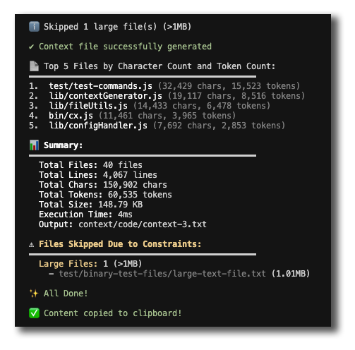

# aictx

A CLI tool that helps AI tools better understand your codebase. Run with `cx` command.


## Overview

Generate context files from your code to help AI tools like ChatGPT, Claude, or Cursor provide more accurate assistance. Supports code patterns and templates for reuse across projects.

## Installation

```bash
npm install -g aictx
```

Update:
```bash
npm update -g aictx
```

## Usage

```bash
cx <directory> [options]
```

### Basic Usage
```bash
# Generate context for current directory
cx ./
```

### Working with Templates

```bash
# Save a pattern globally (stored in ~/.aictx/templates)
# Great for saving reusable implementations
cx ./src/auth --template jwt-auth

# View and load templates from anywhere
cx --template-list
# Select a template to load it into ./context/template

# Quick access through menu
cx
# Select option 4 to view templates
```

### Template Workflow
1. Find useful code pattern you want to reuse
2. Save it as a global template
3. In any other project, list and load the template
4. Copy template contents to your AI tool
5. Ask AI to adapt the pattern to your current project

Example AI prompt:
"Using this JWT auth implementation as reference, create similar auth for my project"

## Features

- 📁 Scans directories for JavaScript, TypeScript, JSON, ENV files and more
- 🌳 Includes full directory structure
- 📝 Creates comprehensive context files
- 🗜️ Optional text compression to reduce context size
- 🔄 Automatic sequence numbering for multiple scans
- 📋 Maintains code readability for AI tools
- ✨ Automatic .gitignore management
- 🔍 Perfect for studying other projects' architecture and patterns
- 🎯 Helps AI understand similar projects for better code suggestions
- 🔐 Includes configuration files and environment templates
- 💾 Save reusable code patterns as templates
- 🌍 Access your templates from any project
- 📚 Build a personal library of code solutions

## Options

- `-h, --help`: Show help
- `--no-minimize`: Override config to generate uncompressed output
- `--min`: Force generate a minimized version (in addition to current output)
- `-s, --snap`: Create a snapshot in context/snap (not affected by --clear)
- `--template <name>`: Save as a reusable template in ~/.aictx/templates
- `--configure`: Set up configuration
- `--show`: Show current configuration
- `--clear`: Remove all generated context files (preserves snapshots)

Note: Running `cx` without arguments shows an interactive menu where you can configure, view templates, and more.

## Examples



Generate a context file for the current directory:
```bash
cx ./
```

Generate a snapshot:
```bash
cx ./ --snap
```

Generate a minimized version:
```bash
cx ./ --min
```

Save a feature as a template:
```bash
cx ./src/auth --template jwt-auth
```

View and load saved templates:
```bash
cx
# Then select option 4 to view templates
```

Clear all generated context files:
```bash
cx --clear
```

Configure the tool:
```bash
cx --configure
```

Show current configuration:
```bash
cx --show
```

### How it works

This will:

1. Scan the source directory for relevant files (JS, JSON, TS, etc.)
2. Create directories based on the type:
   - `context/code` for regular output
   - `context/snap` for snapshots
   - `~/.aictx/templates` for reusable templates
   - `context/template` for loaded templates

3. Generate a context file with the directory structure and file contents
4. Minimize the output by default (can be disabled via config or --no-minimize)
5. Prompt to add `context/` to .gitignore if not present
6. For templates:
   - Save to `~/.aictx/templates` when creating
   - Load to `context/template` when selected from menu

### Output Locations

- Regular output: `context/code/<directory>-context-<n>.txt`
- Snapshots: `context/snap/<directory>-<timestamp>-context-<n>.txt`
- Templates:
   - Saved to: `~/.aictx/templates/<name>-<date>.txt`
   - Loaded to: `context/template/<name>-<date>.txt`

- Minimized versions will have `.min` suffix

The sequence number `<n>` automatically increments for each new scan.
Template dates use YYYY-MM-DD format (e.g., jwt-auth-2024-01-20.txt).

## Why Use AICTX?

- **AI Context**: Provides AI tools with complete codebase understanding
- **Time Saving**: Quickly generates comprehensive context files
- **Space Efficient**: Optimized compression while maintaining readability
- **Version Control Friendly**: Automatic .gitignore management
- **Sequential Tracking**: Maintains history of context generations
- **Reusable Templates**: Save and reuse code patterns across projects
- **Global Access**: Templates stored in home directory for easy access
- **Pattern Library**: Build a personal library of code solutions

## Contributing

Contributions are welcome! Please feel free to submit a Pull Request.

## License

MIT

