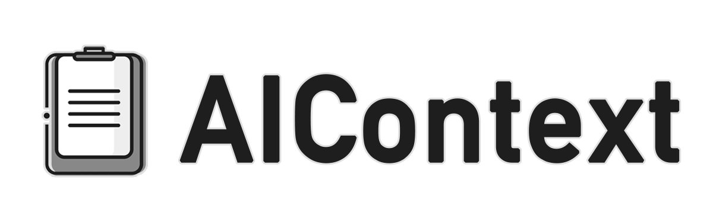

<div align="center">
  
  <h3>Never Let Your AI Agent Forget or Delete Your Code Again</h3>
</div>

## Test Status 🧪

[](TESTS.md)
[](TESTS.md)
[](https://www.npmjs.com/package/aictx)
[](LICENSE)
[](package.json)

Last tested: 03/30/2025, 17:33 America/Los_Angeles

## 📋 What is AIContext?

AIContext is a context tool that helps AI assistants better understand your code. With the cx CLI, it creates intelligent snapshots of your project. Using cx's MCP, it preserves file relationships, tracks development history, and filters out noise—ensuring AI tools grasp your codebase's structure and patterns. ✨

Simply run `cx` and you get:

<div align="center">
  
</div>

## ✨ Key Features

## MCP (IN DEVELOPMENT)

```bash 
cx --mcp
```

- Maintain an up-to-date CONTEXT.md file at the project root that:
- Describes the current state of the application
- Explains what each component does
- Documents how files relate to each other
- Includes a directory structure overview

(to be released soon) 

### ClI 

```bash 
cx 
```

- Automatically excludes binary files, build artifacts, and other non-essential files
- Create point-in-time snapshots of your codebase
- Easily exclude specific files or directories
- Automatically copy context to clipboard (Configure)
- Includes a visual representation of your project structure

## 🚀 Quick Start

Install globally
```bash
npm install -g aicontextjs
```
or force the latest 
```bash
npm install -g aicontextjs@latest
```
Generate context from current directory
```bash
cx
```
Generate context from specific directory with a message
```bash
cx ./src -m "authentication api"
```

The output will be copied to your clipboard and saved to a context file, ready to paste into your AI tool of choice.

## 📋 Command Reference

```
Usage: cx [directory] [options]
```

### Basic Commands

| Option | Description |
|--------|-------------|
| `-h, --help` | Show help information. Use `-h <category>` for category-specific help |
| `--configure` | Start the configuration wizard to set up preferences |
| `--show` | Display your current configuration settings |
| `--version` | Show the current version of the tool |
| `--clear` | Remove all generated context files inside the ./code folder |
| `--clear-all` | Remove ALL context files and directories (with confirmation) |

### Context Generation Options

| Option | Description |
|--------|-------------|
| `-m, --message "text"` | Add a descriptive message to the context file name |
| `-s, --snap` | Create a snapshot in the context/snap directory |
| `-sm "message"` | Create a snapshot with a message (combined flag) |
| `--verbose, -v` | Show detailed progress during execution (helpful for debugging) |
| `--no-clipboard` | Skip copying content to clipboard (faster execution) |

### File Filtering Options

| Option | Description |
|--------|-------------|
| `--ignore add <pattern>` | Add a glob pattern to exclude files/directories (stored in .aicontext/ignore.json) |
| `--ignore show` | Display all current exclusion patterns |
| `--ignore clear` | Remove all exclusion patterns |
| `--ignore test` | Test the exclusions by showing directory tree with current exclusions |
| `--timeout <seconds>` | Set a custom timeout for file search (default: 30 seconds) |
| `--max-size <MB>` | Set a custom maximum file size (default: 2 MB) |

### Examples

```bash
# Basic context generation
cx                           # Generate context from current directory
cx ./src                     # Generate context from specific directory
cx ./src -m "auth api"       # Add a descriptive message to the context

# Snapshots
cx ./src -s                  # Create a snapshot
cx ./src -sm "before refactor"  # Create snapshot with message
cx ./src -s -m "v1.0 release"   # Same as above (separate flags)

# Exclusion patterns
cx -i "*.o"                  # Exclude all .o files
cx -i "target/**"            # Exclude Rust target directory
cx -i "**/*.min.js"          # Exclude all minified JS files
cx --show-ignore             # List all exclusion patterns

# Performance options
cx ./src --verbose           # Show detailed progress for debugging
cx ./src --timeout 10        # Set a shorter timeout of 10 seconds for large projects
cx ./src --max-size 20       # Set a custom maximum file size of 20 MB
cx ./src --no-clipboard      # Skip clipboard operations for faster execution

# Clean up
cx --clear                   # Remove all generated context files (except snapshots)
cx --clear -s                # Remove all context files AND snapshots
cx --clear-all               # Remove ALL context files and directories (with confirmation)
```

## 📋 Configuration

Use `cx --configure` to set up your preferences for a customized experience:

### Available Configuration Options:

| Setting | Description |
|---------|-------------|
| **Auto-clipboard copy** | Enable/disable automatic copying of generated context to clipboard |
| **Default timeout** | Set the default timeout in seconds for scanning directories (default: 10s) |
| **Max file size** | Set the maximum file size in MB to include in context (default: 1MB) |

These settings help you customize how AIContext operates to match your workflow. For example, disabling clipboard copy can speed up execution, while adjusting timeout and file size limits can help with larger projects.

View your current configuration with `cx --show`.

Configuration is stored in `~/.aicontext/config.json` and can be manually edited if needed.

## 🚫 Binary File Handling

AIContext automatically excludes binary files to ensure your context remains clean and focused on code:

### Automatic Exclusions:

- **Binary file types**: Executables (`.exe`, `.dll`, `.so`), object files (`.o`, `.obj`), compiled code
- **Media files**: Images, audio, video (`.png`, `.jpg`, `.mp3`, `.mp4`, etc.)
- **Compressed files**: Archives (`.zip`, `.tar.gz`, `.rar`, etc.)
- **Large files**: Any file exceeding the configured size limit (default: 2MB)
- **Build artifacts**: Common build directories and artifacts

### Managing Exclusions:

```bash
# Add custom exclusion pattern (stored in .aicontext/ignore.json in current directory)
cx --ignore add "target/**"    # Exclude Rust target directory
cx --ignore add "*.min.js"     # Exclude all minified JS files
cx --ignore add "./ecs"        # Exclude a specific directory by path

# View current exclusion patterns
cx --ignore show

# Test exclusions with directory tree view
cx --ignore test

# Clear all exclusion patterns
cx --ignore clear
```

### Directory Exclusions:

You can exclude directories in several ways:
1. Specify just the directory name: `cx --ignore add "build"`
2. Add a relative path: `cx --ignore add "./ecs"`
3. Use glob patterns: `cx --ignore add "test/**"`

### Local Exclusions:

For project-specific exclusions, AIContext uses a `.aicontext/ignore.json` file in each directory where you run the tool. This allows you to have different exclusion patterns for different projects or subdirectories.

```json
{
  "patterns": ["*.log", "temp/*", "**/*.min.js"],
  "alwaysExcludedDirectories": ["logs", "temp-data"],
  "alwaysExcludedFiles": ["private.config"]
}
```

The `.aicontext` directory is created automatically in your project when you run any `--ignore` related command. You can also create it manually and edit the `ignore.json` file directly.

#### How Ignore Patterns Work:

- **Simple glob patterns**: `*.log` excludes all files with the .log extension
- **Directory specific**: `logs/**` excludes everything in the logs directory
- **Complex patterns**: `**/*.min.js` excludes all minified JavaScript files in any directory
- **Extension groups**: `*.{jpg,png,gif}` excludes multiple file extensions

This approach ensures:
- Each project can have its own exclusion rules
- Exclusions are relative to the current working directory
- Teams can share exclusion patterns by committing `.aicontext/ignore.json` to version control

Critical directories like `node_modules`, `dist`, and `.git` are always excluded regardless of local settings.

### Configuration Locations:

- **Local Exclusions**: Stored in `.aicontext/ignore.json` in the current directory
- **User Configuration**: Stored in `~/.aicontext/config.json`
- **Global Exclusions**: Stored in `~/.aicontext/exclude.json` (legacy, local exclusions preferred)

## 💡 Best Practices

1. Add the 'context' folder to your .gitignore file
2. Use meaningful messages for better organization
3. Create snapshots before major changes
4. Clear old context files regularly with `cx --clear`
5. Use the latest-context.txt file for AI tools integration

## 📝 Updates

See [UPDATES.md](UPDATES.md) for a history of changes and new features.

## 🤝 Need Help?

- Basic help: `cx -h`

AIContext includes several ways to get help:

### Built-in Help
```bash
# General help
cx -h

# Category-specific help
cx -h snapshots      # Help with snapshot commands
cx -h basic          # Basic command help
cx -h ignore         # Help with exclusion patterns
```

### Verbose Mode
For troubleshooting issues, use verbose mode to see detailed output:
```bash
cx ./src -v          # Show detailed processing information
```

### Timeout Issues
If you're getting timeout errors with large projects:
```bash
cx ./src --timeout 60  # Increase timeout to 60 seconds
```

### Contributing & Issues
- Report bugs and suggest features on [GitHub Issues](https://github.com/csanz/aictx/issues)
- For questions, use [GitHub Discussions](https://github.com/csanz/aictx/discussions)

## 📄 License

MIT
