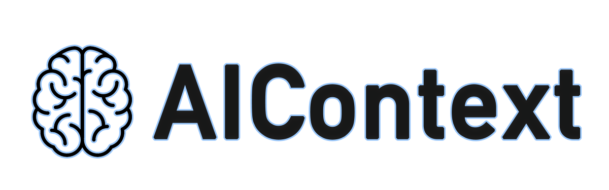
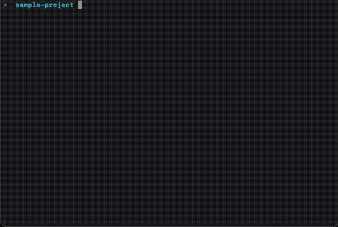

<div align="center">
  
  <h3>Context Management for AI-Assisted Development</h3>
</div>

📢 **Latest Update (v1.5.0)**: Improved ignore command UX - add patterns directly with `cx ignore "pattern"`, remove with `cx ignore rm "pattern"`. All file types (including .js/.txt) now respect ignore patterns. [See all updates](UPDATES.md)

## Test Status 🧪

[](TESTS.md)
[](TESTS.md)
[](https://www.npmjs.com/package/ai-context)
[](LICENSE)
[](package.json)

Last tested: 02/03/2026, 09:40 America/Los_Angeles

## What is AIContext?

A CLI tool that generates structured context from your codebase for AI tools. It scans your project, filters out build artifacts and binary files, and creates a formatted output that maintains code relationships and project structure. The tool handles file exclusions through `.gitignore` integration and custom ignore patterns.

Run `cx` in your project:

<div align="center">
  
</div>

## ✨ Key Features

- Automatically excludes binary files, build artifacts, and other non-essential files
- Create point-in-time snapshots of your codebase
- Easily exclude specific files or directories with glob patterns
- Automatically copy context to clipboard (configurable)
- Includes a visual representation of your project structure

## 🚀 Quick Start

Install globally
```bash
npm install -g ai-context
```
or force the latest
```bash
npm install -g ai-context@latest
```
Generate context from current directory
```bash
cx
```
Generate context from specific directory with a message
```bash
cx ./src -m "authentication api"
```

The output will be copied to your clipboard and saved to a context file, ready to paste into your AI tool of choice.

## 📋 Command Reference

```
Usage: cx [directory] [options]
```

### Basic Commands

| Option | Description |
|--------|-------------|
| `-h, --help` | Show help information. Use `-h --more` for detailed help |
| `configure` | Configure settings |
| `show` | Show current configuration |
| `ignore` | Manage ignore patterns |
| `-v, --version` | Show the current version of the tool |
| `--clear` | Remove all generated context files inside the ./code folder |
| `--clear-all` | Remove ALL context files and directories (with confirmation) |

### Context Generation Options

| Option | Description |
|--------|-------------|
| `-m, --message "text"` | Add a descriptive message to the context file name |
| `-s, --snap` | Create a snapshot in the .aicontext/snapshots directory |
| `-o` | Output directly to screen (supports piping, bypasses file creation) |
| `-t, --tree` | Display directory tree only |
| `--verbose` | Show detailed progress during execution |
| `--no-clipboard` | Skip copying content to clipboard |

### File Filtering Options

| Option | Description |
|--------|-------------|
| `ignore <pattern>` | Add a glob pattern to exclude files/directories |
| `ignore rm <pattern>` | Remove an exclusion pattern |
| `ignore show` | Display all current exclusion patterns |
| `ignore clear` | Remove all exclusion patterns |
| `ignore test` | Test the exclusions by showing directory tree |
| `--timeout <seconds>` | Set a custom timeout (default: 10 seconds) |
| `--max-size <MB>` | Set a custom maximum file size (default: 1 MB) |

### Examples

```bash
# Basic context generation
cx                           # Generate context from current directory
cx ./src                     # Generate context from specific directory
cx ./src -m "auth api"       # Add a descriptive message to the context

# Direct output and piping
cx -o                        # Output directly to screen
cx ./src -o                  # Output specific directory to screen
cx ./src -o | grep "func"   # Pipe output to grep for filtering
cx -o | head -n 50          # Show first 50 lines of context

# Snapshots
cx ./src -s                  # Create a snapshot
cx -s -m "before refactor"   # Create snapshot with message

# Directory tree
cx -t                        # Show directory tree for current directory
cx -t ./src ./lib           # Show trees for multiple paths

# Configuration and ignore patterns
cx configure                 # Configure settings
cx show                     # Show current configuration
cx ignore "*.log"           # Add ignore pattern
cx ignore rm "*.log"        # Remove ignore pattern
cx ignore show              # Show all patterns
cx ignore clear             # Remove all patterns

# Performance options
cx --verbose                # Show detailed progress
cx --timeout 10            # Set a shorter timeout of 10 seconds
cx --max-size 20           # Set a custom maximum file size of 20 MB
cx --no-clipboard          # Skip clipboard operations

# Clean up
cx --clear                 # Remove all generated context files (except snapshots)
cx --clear-all            # Remove ALL context files and directories (with confirmation)
```

## 📋 Configuration

Use `cx configure` to set up your preferences for a customized experience:

### Available Configuration Options:

| Setting | Description |
|---------|-------------|
| **Auto-clipboard copy** | Enable/disable automatic copying of generated context to clipboard |
| **Default timeout** | Set the default timeout in seconds for scanning directories (default: 10s) |
| **Max file size** | Set the maximum file size in MB to include in context (default: 1MB) |

These settings help you customize how AIContext operates to match your workflow. For example, disabling clipboard copy can speed up execution, while adjusting timeout and file size limits can help with larger projects.

View your current configuration with `cx show`.

Configuration is stored in `~/.aicontext/config.json` and can be manually edited if needed.

## 🚫 File Exclusions & Ignore Patterns

AIContext intelligently manages which files to include in your context:

### Default Exclusions

The following are automatically excluded:
- Binary files (executables, object files, media files)
- Common build directories (`node_modules`, `dist`, `.git`, etc.)
- Files larger than the configured size limit (default: 1MB)
- Compressed archives (`.zip`, `.tar.gz`, etc.)

### Managing Custom Exclusions

Use the `ignore` command to manage your exclusion patterns:

```bash
# Add exclusion patterns
cx ignore "*.log"              # Exclude all log files
cx ignore "build/**"           # Exclude build directory
cx ignore "**/*.min.js"        # Exclude all minified JS files

# Remove a pattern
cx ignore rm "*.log"           # Remove the *.log pattern

# View and manage patterns
cx ignore show                 # List current patterns
cx ignore test                 # Preview what will be excluded
cx ignore clear                # Remove all patterns
```

### Pattern Types

- **Simple patterns**: `*.log`, `*.tmp`
- **Directory patterns**: `build/**`, `temp/*`
- **Path-based**: `./src/tests/**`
- **Multiple extensions**: `*.{jpg,png,gif}`

### Configuration Files

- Project-specific exclusions: `.aicontext/ignore.json`
- Global exclusions: `~/.aicontext/config.json`

Tip: Add `.aicontext` to your `.gitignore` if you don't want to share exclusion patterns with your team.

## 💡 Best Practices

1. Add the 'context' folder to your .gitignore file
2. Use meaningful messages for better organization
3. Create snapshots before major changes
4. Clear old context files regularly with `cx --clear`
5. Use the latest-context.txt file for AI tools integration

## 📝 Updates

See [UPDATES.md](UPDATES.md) for a history of changes and new features.

## 🤝 Need Help?

AIContext includes several ways to get help:

### Built-in Help
```bash
# Basic help
cx -h

# Detailed help with all options
cx -h --more
```

### Verbose Mode
For troubleshooting issues, use verbose mode to see detailed output:
```bash
cx --verbose        # Show detailed processing information
```

### Timeout Issues
If you're getting timeout errors with large projects:
```bash
cx --timeout 60    # Increase timeout to 60 seconds
```

### Contributing & Issues
- Report bugs and suggest features on [GitHub Issues](https://github.com/csanz/aictx/issues)
- For questions, use [GitHub Discussions](https://github.com/csanz/aictx/discussions)

## 📄 License

MIT
